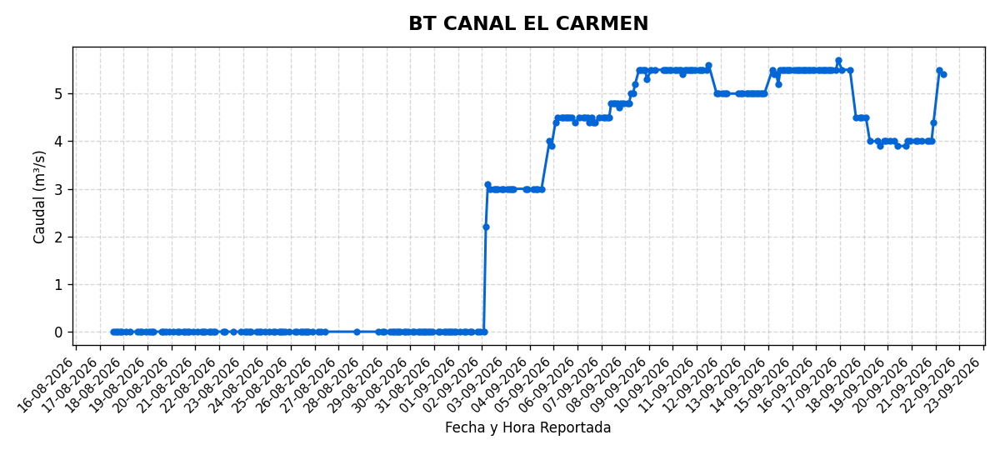
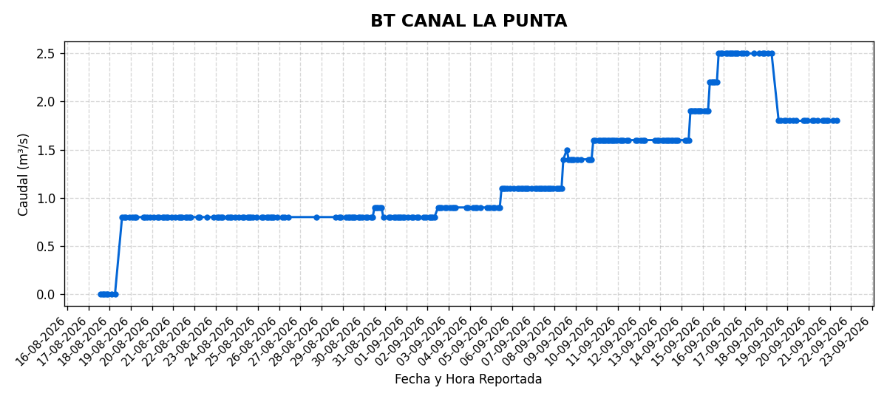
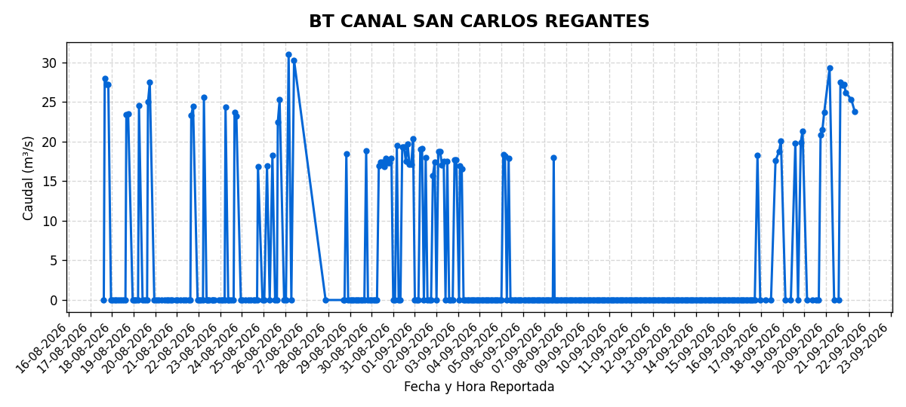
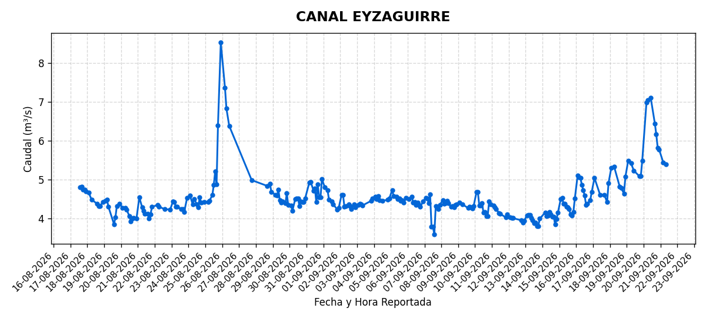
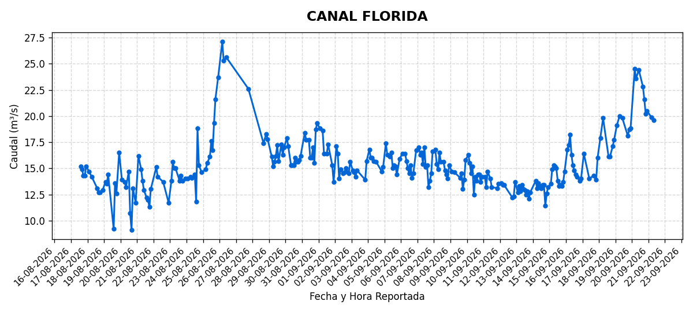
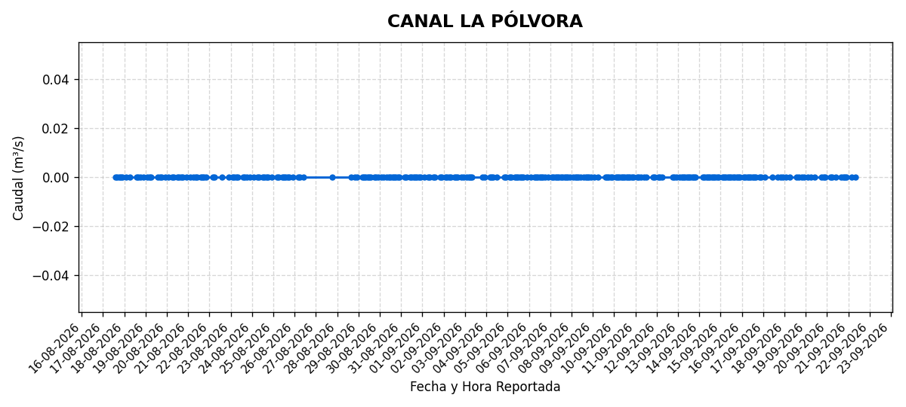
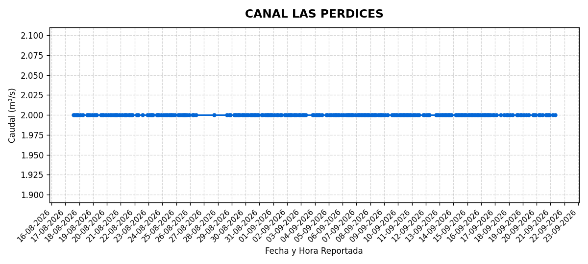
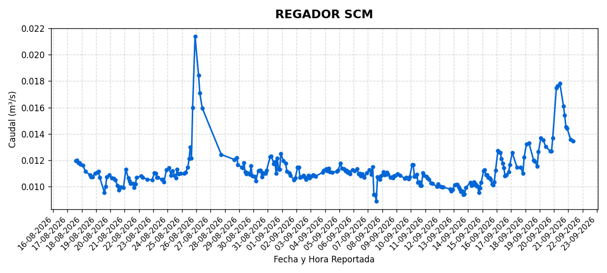
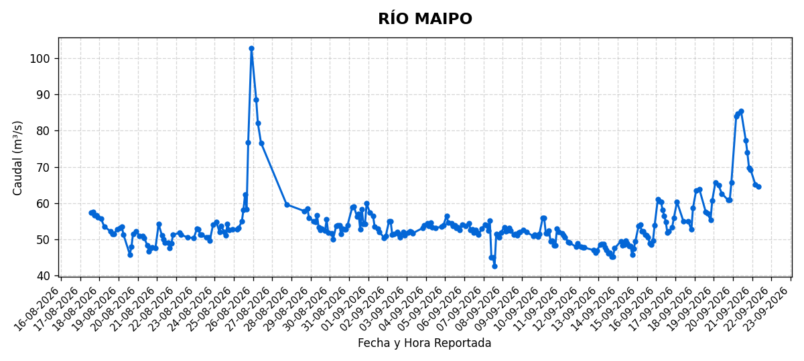

# 📊 Monitoreo de Caudales SCM

Visualización de caudales reportados por la Sociedad de Canal del Maipo.

> *Los gráficos se actualizan cada 2 horas.*

---

## BT CANAL EL CARMEN

---

## BT CANAL LA PUNTA

---

## BT CANAL SAN CARLOS REGANTES

---

## CANAL EYZAGUIRRE

---

## CANAL FLORIDA

---

## CANAL LA PÓLVORA

---

## CANAL LAS PERDICES

---

## REGADOR SCM

---

## RÍO MAIPO

---

